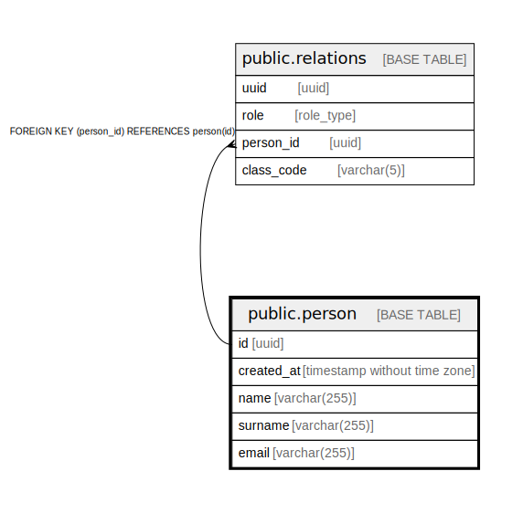

# public.person

## Description

## Columns

| Name | Type | Default | Nullable | Children | Parents | Comment |
| ---- | ---- | ------- | -------- | -------- | ------- | ------- |
| id | uuid | uuid_generate_v4() | false | [public.relations](public.relations.md) |  |  |
| created_at | timestamp without time zone | CURRENT_TIMESTAMP | false |  |  |  |
| name | varchar(255) |  | false |  |  |  |
| surname | varchar(255) |  | false |  |  |  |
| email | varchar(255) |  | false |  |  |  |

## Constraints

| Name | Type | Definition |
| ---- | ---- | ---------- |
| person_pkey | PRIMARY KEY | PRIMARY KEY (id) |

## Indexes

| Name | Definition |
| ---- | ---------- |
| person_pkey | CREATE UNIQUE INDEX person_pkey ON public.person USING btree (id) |

## Relations

---

> Generated by [tbls](https://github.com/k1LoW/tbls)
