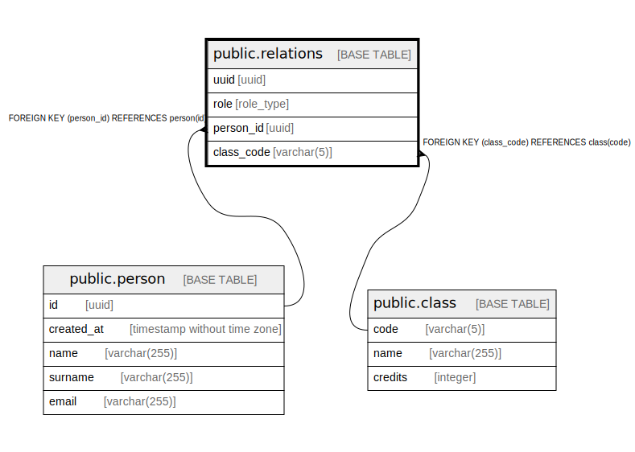

# public.relations

## Description

## Columns

| Name | Type | Default | Nullable | Children | Parents | Comment |
| ---- | ---- | ------- | -------- | -------- | ------- | ------- |
| uuid | uuid | uuid_generate_v4() | false |  |  |  |
| role | role_type |  | false |  |  |  |
| person_id | uuid |  | false |  | [public.person](public.person.md) |  |
| class_code | varchar(5) |  | false |  | [public.class](public.class.md) |  |

## Constraints

| Name | Type | Definition |
| ---- | ---- | ---------- |
| relations_person_id_fkey | FOREIGN KEY | FOREIGN KEY (person_id) REFERENCES person(id) |
| relations_class_code_fkey | FOREIGN KEY | FOREIGN KEY (class_code) REFERENCES class(code) |
| relations_pkey | PRIMARY KEY | PRIMARY KEY (uuid) |

## Indexes

| Name | Definition |
| ---- | ---------- |
| relations_pkey | CREATE UNIQUE INDEX relations_pkey ON public.relations USING btree (uuid) |

## Relations

---

> Generated by [tbls](https://github.com/k1LoW/tbls)
