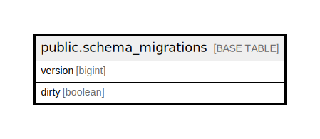

# public.schema_migrations

## Description

## Columns

| Name | Type | Default | Nullable | Children | Parents | Comment |
| ---- | ---- | ------- | -------- | -------- | ------- | ------- |
| version | bigint |  | false |  |  |  |
| dirty | boolean |  | false |  |  |  |

## Constraints

| Name | Type | Definition |
| ---- | ---- | ---------- |
| schema_migrations_pkey | PRIMARY KEY | PRIMARY KEY (version) |

## Indexes

| Name | Definition |
| ---- | ---------- |
| schema_migrations_pkey | CREATE UNIQUE INDEX schema_migrations_pkey ON public.schema_migrations USING btree (version) |

## Triggers

| Name | Definition |
| ---- | ---------- |
| track_applied_migrations | CREATE TRIGGER track_applied_migrations AFTER INSERT ON public.schema_migrations FOR EACH ROW EXECUTE FUNCTION track_applied_migration() |

## Relations

---

> Generated by [tbls](https://github.com/k1LoW/tbls)
